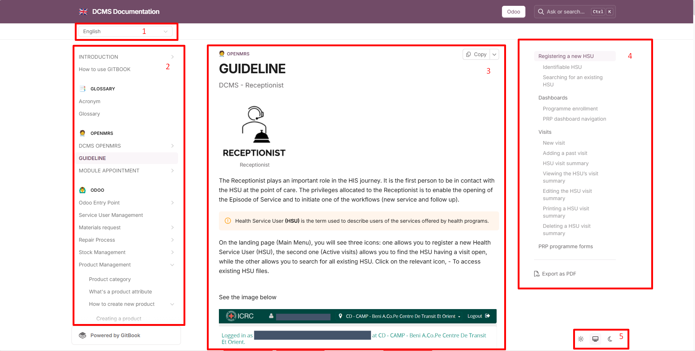

# DCMS LIGHT

### CIRCUIT NOUVEAU SERVICE

## PAGE D ACCUEIL

<figure><figcaption></figcaption></figure>

##

<figure><figcaption></figcaption></figure>

### LOG IN

1. vous vous connectez à votre location et ensuite selectionnez entrer

<figure><figcaption></figcaption></figure>

<figure><figcaption></figcaption></figure>

1. Si vous devez enregistré un nouveau utilisateur de santé.
2. Si il/elle est dejà enregistrée, vous allez dans trouver le dossier (example dossier PMS).

<figure><figcaption></figcaption></figure>

<figure><figcaption></figcaption></figure>

<figure><figcaption></figcaption></figure>

<figure><figcaption></figcaption></figure>

<figure><figcaption></figcaption></figure>

***


Une fois la création de l'utilisateur de santé confirmé, vous pouvez ouvrir le dossier en commencant la visite (démarrer la consultation)


<figure><figcaption></figcaption></figure>

<figure><figcaption></figcaption></figure>


La première étape de création de dossier commence avec le premier formulaire "décision initiale après l'enregistrement"



le dossier est active donc vous pouvez completer les formulaires.


<figure><figcaption></figcaption></figure>

<figure><figcaption></figcaption></figure>

<figure><figcaption></figcaption></figure>


Si l'utilisateur a besoin d'un nouveau service vous Séléctionnez "nouveau service" et ensuite vous pouvez appliquer les étapes suivantes.

Si l'utilisateur a besoin d'une réparation vous Séléctionnez "suivi/réparation" (explication plus tard)

Attention quand vous validez le formulaire vous ne pouvez plus modifiez le formulaire.


<figure><figcaption></figcaption></figure>

***


Vous ouvrez le formulaire "Nouveau formulaire de service" qui sera votre dossier principal!


<figure><figcaption></figcaption></figure>

<figure><figcaption></figcaption></figure>


ce formulaire est divisé en quatre sections; dans une première phase vous completez les 3 premières catégories;

Evaluation initiale qui vous donne les conditions médicales

Plan générale qui vous donne l'accès à la prescription

Evaluation financière pour estimer les couts de services.


<figure><figcaption></figcaption></figure>

<figure><figcaption></figcaption></figure>


Si vous utilisateur est éligible vous pouvez planifier les services, les 3 autres options vous donnent la flexibilité de prendre une décision sur la continuation.&#x20;


<figure><figcaption></figcaption></figure>


Une fois les 3 premières sections complétés, sauvegarder le formulaire mais ne le valider pas car il devra être terminer quand vous finalisez les services.


<figure><figcaption></figcaption></figure>


Vous pouvez éditer en clickant sur le crayon dans la page de visite.


<figure><figcaption></figcaption></figure>

<figure><figcaption></figcaption></figure>

<figure><figcaption></figcaption></figure>


Si vous avez besoin de quitter la page et de revenir sur le dossier du USS, cherchez l nom de l'utilisateur dans active visite quand il est en cours de traitement.


<figure><figcaption></figcaption></figure>

<figure><figcaption></figcaption></figure>

<figure><figcaption></figcaption></figure>

<figure><figcaption></figcaption></figure>


Veuillez trouver l'historique des formulaires completés.


<figure><figcaption></figcaption></figure>

<figure><figcaption></figcaption></figure>

<figure><figcaption></figcaption></figure>

## CIRCUIT SUIVI  ET REPARATION

Si l USS revient pour un suivi vous pouvez trouver son dossier.

<figure><figcaption></figcaption></figure>

Vous avez le DCMS Light et vous pouvez trouver les formulaires essentiels apres avoir demarrer la consultation.

<figure><figcaption></figcaption></figure>

<figure><figcaption></figcaption></figure> <figure><figcaption></figcaption></figure>

<figure><figcaption></figcaption></figure>

Ensuite vous ouvrez le formulaire Decision initial et vous Séléctionnez SUIVI.

<figure><figcaption></figcaption></figure>

<figure><figcaption></figcaption></figure>

<figure><figcaption></figcaption></figure>

<figure><figcaption></figcaption></figure>

<figure><figcaption></figcaption></figure>

Pour retourner dans PRP formulaire et continuer

Vous pouvez ouvrir le FORMULAIRE SUIVI

<figure><figcaption></figcaption></figure>

***

<figure><figcaption></figcaption></figure>

<figure><figcaption></figcaption></figure>

<figure><figcaption></figcaption></figure>

