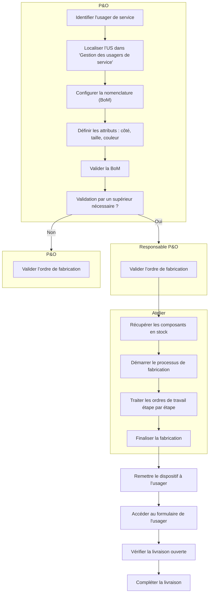

# Demande de matériel pour produit fabriqué

Cette section décrit le **processus MRP (planification des ressources de fabrication)** dans Odoo, pour la gestion des demandes d’usagers de service concernant des dispositifs médicaux (prothèses, orthèses, béquilles, fauteuils roulants, aides à la marche, etc.).

## Prérequis

Le processus commence lorsqu’un usager de service demande un dispositif spécifique. Cela déclenche une série d’étapes pour s’assurer que l’article demandé est correctement configuré, fabriqué et livré.

## Flux du processus MRP



#### Identifier l’usager de service

Localisez l'utilisateur de service dans le menu « Gestion des l'utilisateurs de service ».



#### [Créer la nomenclature (BoM)](demande-de-materiaux-pour-produit-manufacture/creation-de-la-configuration-de-nomenclature-bom/)

Créez une configuration de nomenclature pour définir les attributs du produit (par exemple : côté, taille, couleur).



#### [Valider la nomenclature (BoM)](demande-de-materiaux-pour-produit-manufacture/gestion-des-ordres-mrp/)

Confirmez la configuration. Dans certains cas, la validation d’un supérieur est requise pour poursuivre l’ordre de fabrication.



#### Processus de fabrication

* Démarrez l’ordre de fabrication.
* Traiter les ordres de travail étape par étape.
* Certaines étapes peuvent nécessiter une validation supplémentaire par un autre utilisateur.



#### Finaliser l’ordre de fabrication

Complétez le processus de fabrication une fois que tous les ordres de travail sont complétés.



#### Remettre le dispositif à l’usager de service

* Accédez au **formulaire de l’usager de service**.
* Vérifiez s’il existe une livraison ouverte et complétez le processus de livraison.



## Organigramme

