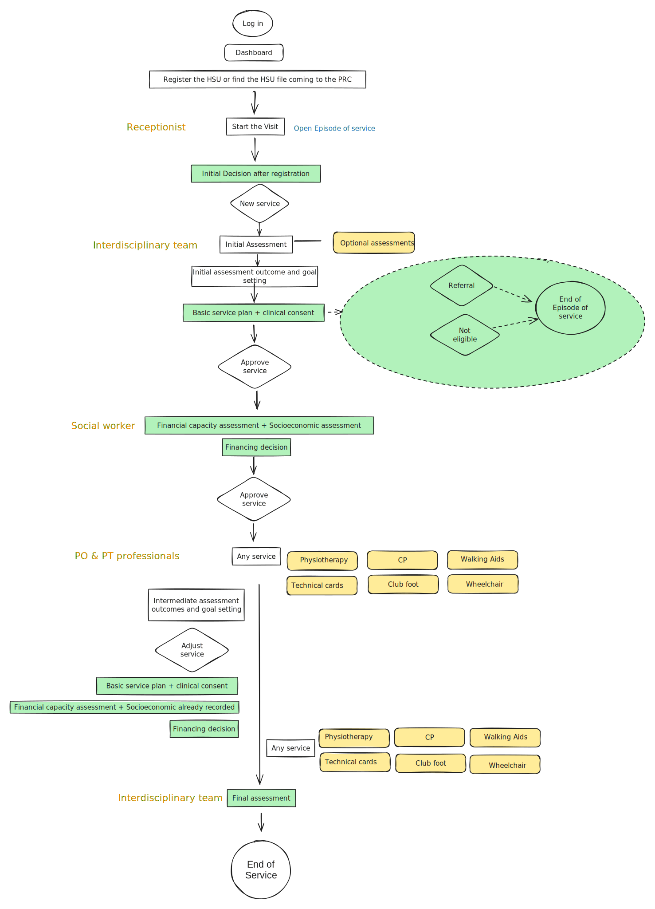

# HSU Journey and Workflows

## The workflow New service

Register the HSU or find the HSU file coming to the PRC

* Start the Visit (Open the Episode of service)
* Initial Decision after registration&#x20;
* Initial Assessment (+ optional assessment forms)
* Initial outcome and goal setting
* Basic service plan + clinical consent
* Financial capacity assessment+ Socioeconomic assessment
* Any service (Physiotherapy assessment, technical cards, Wheelchair assessment, Walking aids ect..)

_Optional_&#x20;


option: Intermediate assessment (Adjust service)&#x20;

\+ Basic Service&#x20;

\+ Financial Capacity assessment (Socioeconomic assessment already done)

\+ Financing decision

\+ Service&#x20;


* Final assessment (Automatic closure of Episode of Service)

*

*

## The Workflow Follow up

<figure><figcaption></figcaption></figure>
