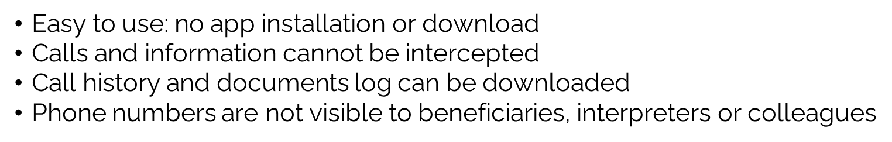
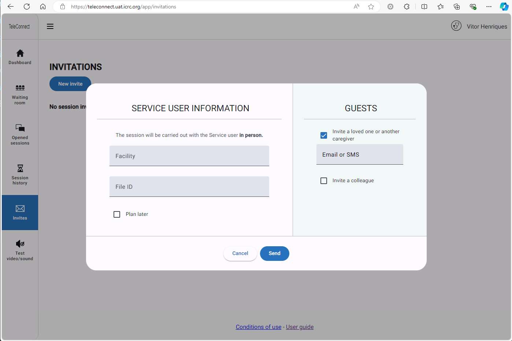

# 1.1 Teleconnect session As a Requester

## 1.1. As a requester

A requester is any user wishing to connect with a Service User, colleague or other user

### **1.1.1. Carry out a remote session without prior planning**

You have decided to start a remote session with a Service User or a colleague using audio, video or using an instant messaging chat.

In this case, you will inform the the person you will connect with, that s/he will receive a session link by SMS, WhatsApp or by email so that you may have a session via a secure video or audio call or can write message in a chat.

Here is an example of how it works.

#### **Step 1: Connect to TeleConnect**

Use [_this link_](https://teleconnect.ext.icrc.org/) to connect to TeleConnect.

The connection is then made through your ICRC credentials.

You will land on the Homepage as below:

> 🗩 Advice&#x20;
>
> If you don't have an access yet, please refer to your Health Program Coordinator or TeleConnect focal person.

#### **Step 2: Create the session**

From the Menu "Invites", you click on the button "New invite"

<figure><figcaption></figcaption></figure>

Then, from the window that will pop up, you will select "Remote" service user.

<figure><figcaption></figcaption></figure>

> 🖋 Note&#x20;
>
> The other possibility "Service user in person" is meant to allow you to call a colleague while a Service User is next to you, and you need some advice. Which is a different use case.

Once you've clicked on the "invite" button under "Remote service user", you can ll in the form with person's information, and click on "send" to send the invitation (either by email or telephone, depending on the information you indicated in the form)

<figure><figcaption></figcaption></figure>

> Tip&#x20;
>
> Select the language of your Service User or colleague, for them to receive the email or What'sApp or SMS in their language

Your Service User or colleague has now received the invitation; You need them to connect to the link they received to be able to start the session in TeleConnect.

It is not possible to open the session before the person who received the invitation connects.

Once your Service User or colleague is online, you will receive a notication (sound ringing), and see them in the waiting room as below:

<figure><figcaption></figcaption></figure>

#### **Step 3 : Connect to the session**

Once the other person has connected and you hear the notication, you go to the waiting room (if you are not there already), and click on "start next consultation". This is what you should see.

<figure><figcaption></figcaption></figure>

Click on start the session.

You can start using the chat function and send photos or PDFs via the chat input eld without starting a video or audio call. Or you can start a call.

<figure><figcaption></figcaption></figure>

**Step 4: End the session**

Make sure that any key points are recorded in the chat, for example in a health use case, the diagnosis recommendation or treatment recommendation if consulting with a specialist.

When you have finished the discussion, you click on "Terminate the session" and you can choose to :

a.) "Close" the case (where it is still possible to come back to the case up to 24h after, however all trace of the call will be deleted after 24h)

b.) "Terminate but keep opened" (where you can come back to the case later to send messages in the chat or make another call)

c.) Stay in the current session to resume the contact.

If you choose to close the case, you can download a pdf of the session (but only the start time and date and what has been written in the chat will be documented).

### **1.1.2. Perform a planned session**

You have decided in advance with the Service User or colleague that a remote session will be organized at a given date and time.

You schedule the session in advance. And connect to it when the scheduled day comes.

#### **Step 1: Connect to TeleConnect**

Use [_this link_](https://teleconnect.ext.icrc.org/) to connect to TeleConnect.

> 🗩 Advice&#x20;
>
> If you don't have an access yet, please refer to your TeleConnect focal person or Health Program Coordinator.

The connection is then made through your ICRC credentials.

You will land on the Homepage as below:

<figure><figcaption></figcaption></figure>

#### **Step 1: Schedule the session in advance**

From the Menu "Invites", you click on the button "New invite"

<figure><figcaption></figcaption></figure>

Then, from the window that will pop up, you will select "Remote" service user.

<figure><figcaption></figcaption></figure>

Once you've clicked on the "invite" button under "Remote patient", you can ll in the form with the Service User or colleagues information. There, you will need to tick the box "Plan later" and select the date and time of your TeleConnect session. Finally, click on "send" to send the invitation (by email or telephone, depending on the information you indicated in the form).

<figure><figcaption></figcaption></figure>

Your consultation is now scheduled, and your Service User or colleague has received an email, What'sApp or SMS with the date and time of the consultation, as well as a link to test their device prior to the consultation.

<figure><figcaption></figcaption></figure>

#### **Step 2: Check your scheduled sessions**

To see your scheduled sessions, open the menu "invites". You will see the list of your sessions that are scheduled or still open.

<figure><figcaption></figcaption></figure>

You will see there the scheduled date of each session.

#### **Step 3: Start the session**

You need your Service User or colleague to connect to the link they received to be able to start the session.

It is not possible to open the session before the other person connects.

Once your Service User or colleague will be online, you will receive a notication (sound ringing), and see them in the waiting room as below:

<figure><figcaption></figcaption></figure>

The waiting room is also available from the Dashboard menu (homepage)

#### **Step 4: End the session**

Make sure that any key points are recorded in the chat, for example in a health use case, the diagnosis recommendation or treatment recommendation if consulting with a specialist.

When you have nished the discussion, you click on "Terminate the session" and you can choose to :&#x20;

a.) "Close" the case (where it is still possible to come back to the case up to 24h after, however all trace of the call will be deleted after 24h)

b.) "Terminate but keep opened" (where you can come back to the case later to send messages in the chat or make another call)

c.) Stay in the current session to resume the contact.

If you choose to close the case, you can download a pdf of the session (but only the start time and date and what has been written in the chat will be documented).

### **1.1.3. Invite additional third-party participants**

In some cases you might want to invite a third party into a session, such as an interpreter, another colleague, or a loved one.

For security reasons, this invitation cannot be made during a session already in progress.

It is necessary to create a new invitation to invite a third party.

#### **Step 1: Create a session**

You can refer to use cases "Carry out a remote session without prior planning" or "Perform a planned session" to see how to create a new consultation.

#### **Step 2 : Invite a third party**

From the invitation, you can tick the relevant box "invite a loved one or another caregiver", then ll in the email or mobile number of the person to invite.

<figure><figcaption></figcaption></figure>

Then, this person will receive the same email or message as the Service User, with the same link to connect to the session.

### **1.1.4. Invite a colleague**

There are situations where a TeleConnect session is complicated because of a language barrier. In this case, it is possible to invite an interpreter to the session.

#### **Step 1: Create a session**

You can refer to use cases "Carry out a remote session without prior planning" or "Perform a planned session" to see how to create a new session.

#### **Step 2 : Invite a colleague**

You select the Service User's language. If it is not available, it means that there is no interpretation organization that speaks this language, or that it has not been declared in the system.

<figure><figcaption></figcaption></figure>

Then, you tick the relevant box "Invite a colleague" and you can "Add Another Expert".

> 🖋 Note&#x20;
>
> The language determines which organization is usable.

Upon validation, an email will be sent to a manager or a distribution list of the interpreting organization.

* In the event that the interpretation request is refused or without a response after 24 hours, an email is automatically sent to the requestor indicating that no interpreter is available.&#x20;
* If the interpreter accepts the request, an email will be sent to them with an invitation link in the same way as the patient.

The third party can join a video call already in progress even if they missed the start of the session.

> ⚠ Warning
>
> It is strongly recommended, whenever possible, to plan the session in advance to ensure that an interpreter is available. In addition, it is also important to note that no invitation is sent to the beneficiary as long as an interpreter is not available.
