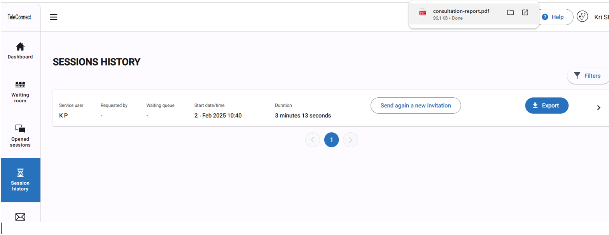

# 2.2 Teleconnect in health As an Expert doctor

2.2. As an expert doctor

You are an expert who has been recruited to answer requests for support from peripheral health workers. The peripheral health worker may be with a patient so needs to connect in real-time, or they may be needing case advice between consultations with the patient.

### **2.2.1.**&#x20;

#### **Step 1. Log into TeleConnect**

Using the link you have been provided, you should be able to access your TeleConnect account.

You are an expert working on the TeleConnect project and you need to answer a call on a new case from a peripheral health worker who needs help.

#### **Step 2. Check your waiting room**

Now you have logged in, you can see your dashboard. In this example, you have some open sessions, and you have some cases waiting in your waiting room. If it is the first time you ever log in or if you have no cases, this will be empty.

<figure><figcaption></figcaption></figure>

Click on waiting room and you will see only the cases waiting for you to answer a call, or for your chat reply.

<figure><figcaption></figcaption></figure>

Cases where the peripheral health worker are online and awaiting your response have a green "online" ag under the service user's name.

#### **Step 3. Open and start a waiting session**

Click on the case to open the session and you will see this screen. Here you see the service user information as well as anything the peripheral health worker has added to the chat.

<figure><figcaption></figcaption></figure>

From here, you can click on "Start the session" at the bottom. Now you will be able to give your advice or ask questions in the chat, add documents or photos, or start a video or audio call if the peripheral health worker is online.

<figure><figcaption></figcaption></figure>

If you choose to start a call, the peripheral health worker will hear a ringing sound and his/her screen will show the call to be answered.

#### **Optional step: Invite a colleague**

It may be that you think it would be beneficial to have a 3rd opinion on the case.

To add another colleague to the session, you can click on the "invite a colleague" button. This will bring up a box whereby you can request a colleague to join your session via SMS or email, or you can copy and paste the session link into whatever communication channel you use to contact that colleague (WhatsApp, Signal, Skype etc)

<figure><figcaption></figcaption></figure>

Your colleague will need to click on the link, enter their name and accept the terms of use, accept the use of their camera and microphone, then enter the session. You will see their name just under the requestor's name and whether they are online.

If you request a call, both the requesting peripheral health worker and your expert 2nd opinion will get an audio alert and will be able to join the 3 way call. If not, the three of you will be able to use the chat function.

<figure><figcaption></figcaption></figure>

**2.2.2. Close a session**

**You have given your advice and now you would like to close the session**

Click on "Close" or "Terminate the session".

As an expert, you have three choices here:

<figure><figcaption></figcaption></figure>

#### **a. Close**

You may have provided advice in one call, or over many days or weeks as the case progressed. Once you are sure the service user has a good management plan, you can close the session. This will close the session completely.

**b.Terminate but keep open**

You have finished giving advice for now, but perhaps you are waiting for test results, or to see how a service user responds to a recommended treatment, so it is likely that you will contact the peripheral health worker again in order to make a management plan. This means that the chat or call session is closed, but the case stays open in your "Open Sessions", which you can access from TeleConnect anytime. You will get an email or SMS notification when there is activity on this case while you were online.

#### **c. Stay in the session**

Go back to the session.

### **2.2.3. Consultation report**

**TeleConnect produces a record of the sessions you have managed in a"Consultation report"**

As you are providing assistance to a peripheral health worker, it is important to record key information in the chat. **The chat forms the electronic record of the TeleExpertise activity.**

Please record information such as the presentation of the Service User, the key reasons why you have advised a particular action and the advice you gave, such as what you asked the peripheral health worker to investigate or prescribe.

The treatment plan should always feature at the bottom of the chat before you close the session.

Remember, what you write in the chat will be in the session record document!

Once the session is closed definitively, in the session history area, you will find a list of the sessions you closed in the last 24 hours only.

<figure><figcaption></figcaption></figure>

As you see here, there is a PDF record of that case or consultation, which you can download and add to an electronic medical record or print and add to a paper patient.

Click on the "Export" button on the right side.&#x20;

Either open the consultation report le from the pop-up in your browser, or go to your le explorer (downloads) to find the file.

<figure><figcaption></figcaption></figure>

Please ensure that once you added or printed the report and added it to the medical record, you remove it from your device by deleting it from your download folder. Try to also clear the cache of your browser around once a week too, for data protection reasons.
